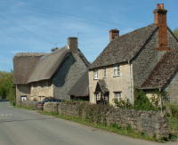

Wytham is a unique village – only 3 miles from Oxford City Centre, but with no modern development
and a real feeling of rural peace. The beautiful buildings, in Cotswold stone, with some thatched,
form a stunning village centre.  Formerly owned for several hundred years by the Earls of Abingdon,
Wytham is now owned by Oxford University. You can read more about the village by visiting
their website here: [Wytham Village website](http://www.wytham-village.org.uk/).

FAI (Food Animal Initiative) took over the tenancy of the Oxford University Farm at Wytham in
September 2001. Its 1050 acres (425ha) are bordered by the famous Wytham Woods and the River
Thames. About 250 acres was arable land and is now converted to organic pasture producing feed for
the animals; the rest is extensive organic grassland managed under the Upper Thames Tributaries
Environmentally Sensitive Area Scheme and Countryside Stewardship. Read more by visiting
[their site](http://www.faifarms.com/).
