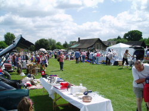
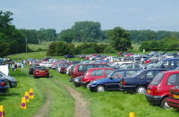

Car boot sales at Wytham Village Hall, have become a favourite venue for Sunday shoppers looking
for a bargain, due in no small part to the fabulous backdrop of Wytham village.

*The Car Boot Sales take place on the first and third Sundays of every month from May to
September.* They attract hoards of enthusiastic sellers and buyers. The sales can attract nearly
200 sellers, and a car park full of buyers.  

A stall (boot) will cost £8.00. Ample car parking is available, free of charge, although we do ask
for voluntary contributions for the Village Hall.

*The gates open for "boots" at 8.30am. The sale is on from 9am to 1pm.*
